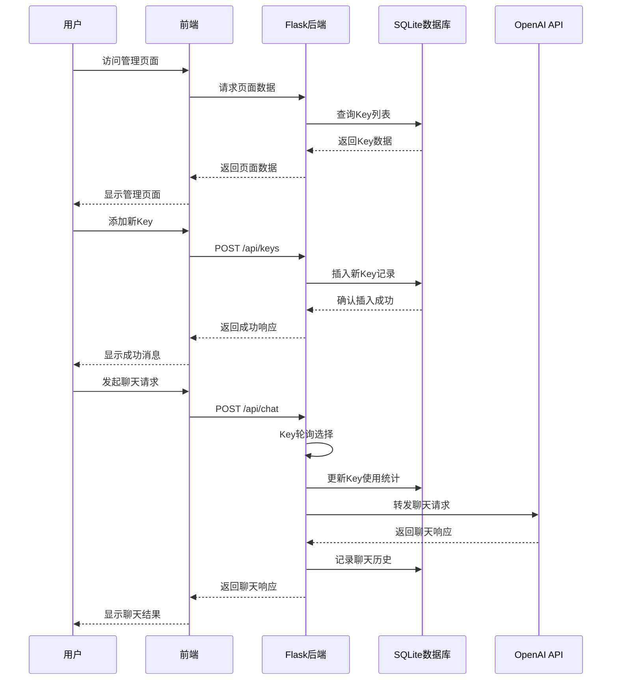
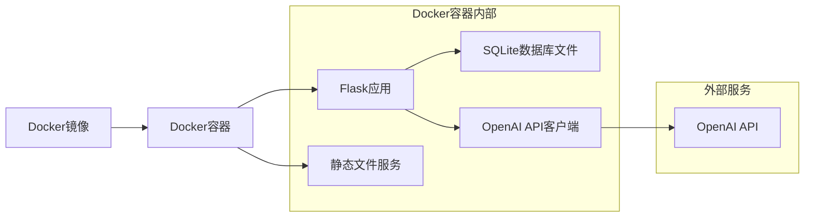

# OpenAI代理服务系统架构

## 系统概述

本系统是一个OpenAI代理服务，使用Flask作为后端框架，纯HTML/CSS/JavaScript作为前端，SQLite作为数据存储，通过单个Docker容器进行一体化部署。系统实现了OpenAI Key的管理、监控统计和模型管理功能，并使用简单的轮询算法来管理多个OpenAI Key。

## 系统架构图

```mermaid
graph TD
    A[用户浏览器] --> B[Docker容器]
    B --> C[Flask后端服务]
    B --> D[前端静态文件]
    
    C --> E[SQLite数据库]
    C --> F[OpenAI API代理服务]
    
    F --> G[Key轮询机制]
    G --> H[OpenAI Key 1]
    G --> I[OpenAI Key 2]
    G --> J[OpenAI Key N]
    
    H --> K[OpenAI API]
    I --> K
    J --> K
    
    E --> L[Keys表]
    E --> M[Usage Stats表]
    E --> N[Models表]
    E --> O[Chat History表]
    
    subgraph "数据库表结构"
        L --> L1[id, key_value, status, created_at, updated_at]
        M --> M1[id, key_id, model, usage_count, last_used]
        N --> N1[id, model_name, description, capabilities]
        O --> O1[id, key_id, model, request, response, timestamp]
    end
    
    subgraph "前端功能模块"
        D --> P[Key管理页面]
        D --> Q[监控统计页面]
        D --> R[模型管理页面]
    end
    
    subgraph "后端API接口"
        C --> S[/api/keys - Key管理]
        C --> T[/api/models - 模型列表]
        C --> U[/api/chat - 聊天接口]
        C --> V[/api/stats - 统计数据]
        C --> W[/api/usage - 使用记录]
    end
```

## 数据流图



## 核心功能模块

### 1. Key管理模块
- **功能**: OpenAI Key的增删查改
- **数据表**: Keys表
- **API接口**: `/api/keys` (GET, POST, PUT, DELETE)
- **前端页面**: Key管理页面

### 2. Key轮询机制
- **功能**: 按顺序循环使用多个OpenAI Key
- **实现方式**: 简单轮询算法
- **状态管理**: 记录当前使用的Key索引

### 3. 监控统计模块
- **功能**: 统计Key使用次数、有效情况、调用记录
- **数据表**: Usage Stats表, Chat History表
- **API接口**: `/api/stats`, `/api/usage`
- **前端页面**: 监控统计页面

### 4. 模型管理模块
- **功能**: 展示模型列表、模型使用情况、聊天功能
- **数据表**: Models表, Chat History表
- **API接口**: `/api/models`, `/api/chat`
- **前端页面**: 模型管理页面

### 5. API代理服务
- **功能**: 转发客户端请求到OpenAI服务器
- **支持的接口**: 模型列表接口、聊天接口
- **认证方式**: 使用轮询选择的OpenAI Key

## 部署架构



## 技术栈

- **后端**: Python + Flask
- **前端**: HTML + CSS + JavaScript
- **数据库**: SQLite
- **容器化**: Docker
- **API集成**: OpenAI API
- **数据可视化**: Chart.js (用于统计图表)